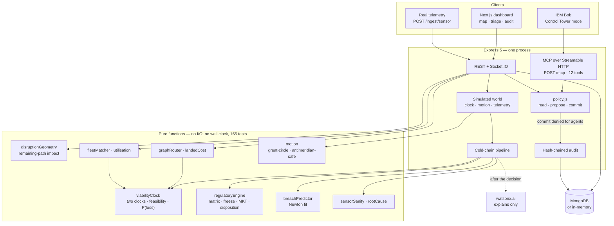

# Architecture

## The shape of it



## Components

| Component | File | Responsibility |
|---|---|---|
| Viability clock | `engines/viabilityClock.js` | Schedule vs stability margin, which binds, feasibility of an option, P(loss) and money at risk |
| Regulatory engine | `engines/regulatoryEngine.js` | Severity matrix, freeze override, cumulative budgets, MKT, disposition, required signer |
| Breach predictor | `engines/breachPredictor.js` | Newton's-law fit over recent readings; warns before the limit is crossed |
| Sensor sanity | `engines/sensorSanity.js` | Spike filtering, silence, stuck sensors, out-of-order |
| Root cause | `engines/rootCause.js` | Door / compressor / power / ambient signatures |
| Disruption geometry | `engines/disruptionGeometry.js` | Point-to-segment against the **remaining** path; hours-to-zone; tariff shocks |
| Graph router | `engines/graphRouter.js` | Dijkstra + Yen k-shortest, blocked and delayed nodes |
| Landed cost | `engines/landedCost.js` | Freight + fees + customs dwell + duty + expected spoilage |
| Fleet matcher | `engines/fleetMatcher.js` | Hard filters, 0–100 score, global assignment, utilisation |
| Motion | `engines/motion.js` | Great-circle motion, antimeridian-safe, remaining path |
| Audit chain | `engines/auditChain.js` | SHA-256 chain over canonical JSON |
| Policy | `engines/policy.js` | read / propose / commit; agents cannot commit |
| Simulated world | `sim/` | Clock, motion loop, position-driven telemetry, record and replay |
| Cold-chain pipeline | `services/coldChain.js` | Ties the engines together per reading |
| MCP surface | `mcp/` | 12 tools over Streamable HTTP, in-process |

## Three rules the codebase holds to

**1. Engines are pure.** No database, no network, no `Date.now()`. Every entry
point that needs the time takes `nowMs`. This is what makes replay possible and
the tests deterministic — and it is greppable:

```bash
grep -rn "Date.now\|require(\"mongoose\")" src/backend/engines/*.js   # no matches
```

**2. The model never decides.** Severity, disposition, the clock and the option
ranking are computed. watsonx is asked afterwards to phrase the conclusion. Pull
the credentials and every number is identical.

**3. An agent may propose; only a human commits.** Enforced in one place
(`policy.js`), checked on both the REST and MCP surfaces, and a refusal is
appended to the hash chain rather than silently returned.

## Data flow: a reading arrives

```
POST /ingest/sensor  (or the simulated world generates one from position + reefer state)
   → sensorSanity     is this believable? spike, silence, stuck, out-of-order
   → band             which band of the rule profile, and for how long
   → regulatoryEngine severity from magnitude × duration, freeze override, MKT
   → viabilityClock   both clocks, which binds, money and doses at risk
   → breachPredictor  Newton fit — will it breach, and when
   → alert            coalesced: one open alert per problem, updated not duplicated
   → socket           lifeclock.updated · breach.predicted · telemetry.alert
```

## Data flow: Bob is refused

```
Bob → POST /mcp  tools/call approve_recommendation
   → policy.can({sub:"bob", roles:["operator-agent"]}, "approve_recommendation")
   → commit + agent  →  DENIED
   → auditService.recordDenial()   appended to the hash chain, actor "bob"
   → Bob receives a readable explanation, not just an error
   → GET /api/v1/audit         shows outcome "denied"
   → GET /api/v1/audit/verify  confirms the chain is intact
```

## Running it

One process. `npm start` in `src/backend` boots with **no API key, no MongoDB
and no network** — it falls back to templated explanations, an in-memory store
which it seeds itself, and serves `/health`. `GET /health` reports
`build: "lifeclock-r2"` so it is obvious whether a server is current.

## Scaling, honestly

Today: one instance, in-process event bus, seeded world. The seams that matter
are already in place — pure engines, a thin bus interface, an actor shaped like
OIDC claims, versioned rule profiles, GeoJSON coordinates.

What would come next, in order: Redis so Socket.IO works across instances, a
durable job queue for the AI calls, real sign-in, an `orgId` scope on every
query, then splitting sensor ingest behind a queue. None of it is built, and
`docs/known-limitations.md` says so.
