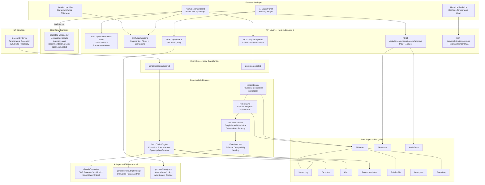

# Architecture

## System Architecture

## Components

| Component | Technology | Responsibility |
|---|---|---|
| Frontend Dashboard | Next.js 16 + React 19 + TypeScript | Main operator UI, KPI cards, action center, alerts feed, sensor feed |
| Live Map | React-Leaflet + Leaflet | Geospatial view of shipments, idle fleets, disruption zones |
| AI Chat Widget | React + Socket.IO client | Floating copilot chat with streaming typing indicator |
| Historical Analytics | Recharts | Hourly average temperature line chart from seeded sensor logs |
| Backend API | Node.js + Express 5 | REST API + Socket.IO server + internal event bus |
| Impact Engine | `engines/impactEngine.js` | Haversine geospatial intersection — disruption radius vs shipment route legs |
| Risk Engine | `engines/riskEngine.js` | 6-factor weighted risk score (0–100) with named driver explanations |
| Cold Chain Engine | `engines/coldChainEngine.js` | Deterministic excursion state machine: Open/Update/Resolve |
| Route Optimizer | `engines/routeOptimizer.js` | Graph-based candidate route generation ranked by cost/time/risk |
| Fleet Matcher | `engines/fleetMatcher.js` | 5-factor idle asset compatibility scoring with hard cold-chain filter |
| AI Service | `aiService.js` + watsonx.ai SDK | Three watsonx.ai call types: excursion classify, rerouting strategy, chat |
| IoT Simulator | `server.js startSimulation()` | 5-second interval mock sensor readings with 25% spike probability |
| MongoDB | Mongoose ODM | 10 domain entity schemas with full relational references |

## Data Flow

### Disruption Event Flow
1. Operator clicks "LA Port Strike" on dashboard → `POST /api/disruptions`
2. Disruption document created in MongoDB; `disruption.created` event emitted on internal bus
3. Impact Engine fetches all `In Transit` shipments, runs Haversine intersection vs disruption geometry
4. Impacted shipments: Risk Engine computes 6-factor score; shipment riskScore updated in DB
5. Route Optimizer generates ranked alternatives; Fleet Matcher scores idle reefer trucks
6. Recommendation document saved; `recommendation.created` Socket.IO event pushes to all connected UIs
7. UI Action Center updates live; operator sees recommendation with rationale

### Cold-Chain Telemetry Flow
1. Simulator fires every 5 seconds; 25% chance of temperature spike (>8°C)
2. SensorLog saved to MongoDB; `sensor.reading.received` event emitted
3. Cold Chain Engine loads shipment's RuleProfile; evaluates temperature against min/max/warningBand
4. If excursion detected: Excursion document opened; Alert created; `telemetry.alert` Socket.IO event fired
5. watsonx.ai called with shipment ID + temperature → GDP severity classification + disposition instruction
6. If reading returns to safe range: Excursion resolved; `excursion.resolved` event emitted

### Action Approval Flow
1. Operator clicks "Approve & Execute" on recommendation
2. `POST /api/v1/recommendations/:id/approve` → Recommendation status = "Approved"
3. Fleet asset status updated to "In Transit" in MongoDB
4. AuditEvent created with actor, action type, entity reference, and timestamp
5. `action.completed` Socket.IO event removes recommendation from all connected UIs

## Security Considerations

- API keys (`WATSONX_API_KEY`, `WATSONX_PROJECT_ID`) stored in environment variables, never committed to git
- `.env` is in `.gitignore`; `.env.example` provides template with dummy values
- CORS configured on backend; Socket.IO allows all origins for demo purposes
- watsonx.ai model prompts treat retrieved data as untrusted and explicitly instruct the model not to fabricate facts

## Scalability Notes

For a production system:
- Replace Node.js `EventEmitter` with Redis + BullMQ for durable, distributed event processing
- Replace local MongoDB with a managed instance (IBM Cloudant, MongoDB Atlas)
- Add PostGIS to the data layer for production-grade geospatial route intersection
- The frontend is stateless and can be horizontally scaled behind a CDN
- Each engine (Impact, Risk, Cold Chain) can be extracted as a separate worker process
